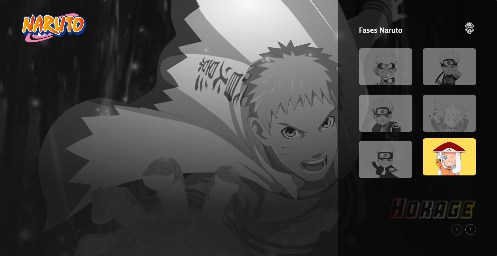

  

  

## Projeto

Site sobre as fases do Uzumaki Naruto.

Clique [aqui](https://fases-naruto.netlify.app/) e veja como ficou!

## Tecnologias Utilizadas

- HTML
- CSS
- JavaScript

## Conhecimentos abordados

- Uso semântico do HTML
- Uso do CSS Flexbox
- Carrousel de imagens
- Menu lateral
- Carregamento de fonte externa
- Uso de cores gradientes no texto

